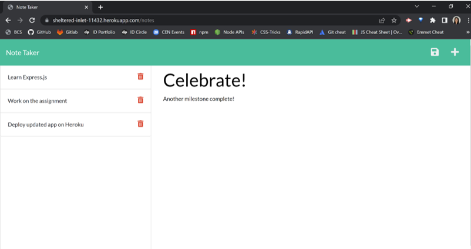

# Note Taker
  
  [](https://opensource.org/licenses/MIT)
  ## Table of Contents
  [Description](#description)  
  [Installation](#installation)  
  [Usage](#usage)  
  [License](#license)      
  [Questions](#questions)
  ## Description
  Have a lot of information that you need to keep track of? Use the Note Taker application to make your life easier! As you would've guessed from the name, the Note Taker app can be used to write, save, and delete notes. The app has an Express.js back end and will save and retrieve note data from a JSON file. The app is [deployed on Heroku](https://sheltered-inlet-11432.herokuapp.com/).  
    

  
  ## Installation
  Open the project's repository, click the ```Code``` dropdown button, copy the SSH key, and input ```git clone SSH key``` in your CLI in the app's root directory. This will create a local copy of the application, which you can use.
  Run ```npm install``` to install all dependencies. Run ```node server.js``` and open ```http://localhost:3004``` in your browser. 
  ## Usage
  You can view, add, or delete notes on the app after you create a local copy.
  Click the following link for a demo of how to open the app and add or delete notes:
  https://drive.google.com/file/d/1MdmVTQrS-YUX4GfMXljNLfUIBJ7vsEqs/view?usp=sharing
  ## License
  MIT
  Copyright (c) Anita Jose. All rights reserved. Licensed under the MIT license.
  ## Questions
  Got any questions? Email the author at: [anitajose119@gmail.com](mailto:anitajose119@gmail.com)  
  Author's GitHub profile: [anitajose1](https://github.com/anitajose1)